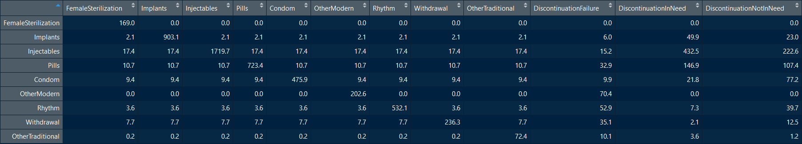

```{r intro, echo=FALSE, results="hide"}
knitr::opts_chunk$set(echo=FALSE, 
                      message=FALSE, 
                      comment = "", 
                      warning=FALSE, 
                      results="hide") 
date<-as.Date(Sys.time(	), format='%d%b%Y')
setwd("C:/Users/YoonJoung Choi/Dropbox/0 Project/FPDynamicsDiagram")
```
Author: YJ Choi  
Last updated: `r date`  

# Family planning dynamics: Chord or Sankey?

This demonstrates and compares two approaches to visualize family planning dynamics data: specifically discontinuation and switching data from DHS.

### 1. Visualizing dynamic data: chord and Sankey diagrams

A [__chord diagram__](https://en.wikipedia.org/wiki/Chord_diagram) is "a graphical method of displaying the inter-relationships between data in a matrix." [This paper on global migration flow](https://science.sciencemag.org/content/343/6178/1520.full) shows a great example of how the diagram can be used to present complex "flow data" on migration across global regions effectively (Figure 1). [Even more detailed version](http://download.gsb.bund.de/BIB/global_flow/VID_Global_Migration_Datasheet_web.pdf) with country-level migration is possible.

__Figure 1. Classic example of a chord diagram visualizing inter-related flow data (Abel and Sander, 2014)__  
```{r, results="asis", fig.align="center", out.width = "400px"}

```
(Source: Abel GJ, Sander N. Quantifying global international migration flows. _Science_. 2014 Mar 28;343(6178):1520-2)

The diagram has become popular in data visualization for various topics, thanks to its ability to portray very complex matrix data and perhaps also its aesthetic strength. However, it is indeed a complex figure and is generally hard to understand quickly - although it is much easier when the diagram is interactive: click here for an amazing [interactive version of the migration figure](http://download.gsb.bund.de/BIB/global_flow/). 

There are interesting and insightful discussions around complexity of chord diagrams like [this](https://questionsindataviz.com/2016/12/05/is-there-a-place-for-chord-charts-in-data-visualisation/) and  [this](http://www.vizwiz.com/2016/12/makeover-monday-global-flow-of-people.html). Some explore and use other diagrams to visualize "flow data" equally or even more effectively, _of course, all depending on specific objectives of data analysis (and thus communication of the results)_. One example is [Sankey diagrams](https://en.wikipedia.org/wiki/Sankey_diagram), named after [an engineer and captain](https://en.wikipedia.org/wiki/Matthew_Henry_Phineas_Riall_Sankey) from a century ago. 

Below figure shows how same migration data from [this paper](https://journals.sagepub.com/doi/abs/10.1111/imre.12327?journalCode=mrxa) can be visualized in chord and Sankey diagrams. Figure 3 is the flow data matrix. (NOTE: the two diagrams were extracted from these excellent sites on data visualization: [here](https://www.data-to-viz.com/graph/chord.html) and [here](https://www.data-to-viz.com/graph/sankey.html).)   

__Figure 2. Same data, different visualization: Chord and Sankey diagrams based on same migration data__ 
```{r, results="asis", fig.align="center",  out.width = "800px"}

```
(Source: https://www.data-to-viz.com/graph/chord.html and https://www.data-to-viz.com/graph/sankey.html)   

__Figure 3. Matrix of migration__ 
```{r, results='asis', fig.align="left", fig.width=16, out.width = "700px"}

```

In this example of migration across regions between two time points, Sankey diagram on the right is relatively easier to understand "flow" because it separates the beginning and end of the period into essentially two stacked bars. Data users do not need to understand chord color and base arc length in the chord diagram on the left. Nevertheless, in my opinion, a consistent box color for each region on both sides might be even easier to understand. The diagram can be also used to visualize multi-period flow data like here, beyond just two-state.   

### 2. Family planning use and demand dynamics

As clearly illustrated in the "leaking bucket" figure, women's contraceptive use and demand for family planning change overtime. Without panel data, it is difficult to have family planning use and demand flow information: i.e., demand met (specifically contracepting), demand not met (a.k.a. "unmet need""), or no demand for family planning.  

__Figure 4. Leaking Bucket__ 
```{r, results='asis', fig.align="center", out.width = "300px"}

```
(Source: Jain A. The leaking bucket phenomenon in family planning. 2014. https://champions4choice.org/2014/09/the-leaking-bucket-phenomenon-in-family-planning/)

But, cross sectional surveys, including the most well known Demographic and Health Surveys, have provided flow information __among women who ever used contraception in the five years before a survey__: i.e., continued using a method, switched to another method, or discontinued the use. [More about the survey's "calendar data" is here](https://www.dhsprogram.com/data/calendar-tutorial/). 

It is often measured in 12-month "rates" (i.e., percent of episodes discontinued/switched within the time frame), and below table shows how the data are presented typically. In this example, overall (see the bottom row, "All methods"), about a quarter of contraceptive use episodes discontinued (because of 7 reasons listed in columns) and 6% of the episodes were switched to another method. Contraceptive use continued 12 months or longer in the rest, about 70%. Rate of discontinuation varies by method, ranging from 10% in implants to 34% in pills. 

__Figure 5. 12-month discontinuation data from Tanzania 2015-2016 DHS__ 
```{r, results='asis', fig.align="left", fig.width=16, out.width = "500px"}

```
(Source: Tanzania DHS 2015-2016)

Given its dynamic nature, a flow diagram would be a good visualization approach. Next section presents reproducible R code to generate the two diagrams using the above data from Tanzania 2015-2016 DHS. 

__But, wait!__ There is missing information to create the diagrams: detailed switching information - for example, among those pill use episodes that switched to other methods (second last column), percent distribution by new switched method. That information is actually available in the "calendar data" but typically not tabulated routinely. Since my purpose here is to demonstrate and compare visualization approaches, no individual-level data are analyzed to calculated that information (which itself alone is a significant and complex data analysis activity!). Rather, the tabulated data are used with a simple, unlikely assumption: the new switched method is randomly chosen (clearly not the case in the real world), and, thus, switching to each method has same probabilities. 

### 3. Diagrams to vizualize family planning use and demand dynamics

#### 3.1. Get the discontinuation and switching tabulation data via DHS API 
Data in the above table can be called via DHS API. See here how the data look like ([in html format](http://api.dhsprogram.com/rest/dhs/data?f=html&indicatorIds=FP_DISR_W_PRG,FP_DISR_W_DES,FP_DISR_W_FRT,FP_DISR_W_SID,FP_DISR_W_WME,FP_DISR_W_MET,FP_DISR_W_OTH,FP_DISR_W_ANY,FP_DISR_W_SWH,FP_DISR_W_NUM&surveyids=TZ2015DHS&breakdown=all&perpage=1000)). To learn more about how to call DHS API data, see this "[How to get DHS API data: introduction](http://rpubs.com/YJ_Choi/HowTo_DHSAPI_Introduction)". To see R code for data access and wrangling in this section, see the markdown file in [GitHub](url).

```{r getdtaTRUE}
# Get required functions 
library(jsonlite) 
library(data.table)
library(dplyr)

# Call 10 indicators (9 columns + the denominator)  
url<-("http://api.dhsprogram.com/rest/dhs/data?f=json&indicatorIds=FP_DISR_W_PRG&surveyids=TZ2015DHS&breakdown=all&perpage=1000")
jsondata<-fromJSON(url) 
dta<-data.table(jsondata$Data)
dta<-select(dta, CountryName, SurveyId, Value, 
            CharacteristicCategory, CharacteristicLabel)   
FP_DISR_W_PRG<- dta %>% rename(FP_DISR_W_PRG=Value)

url<-("http://api.dhsprogram.com/rest/dhs/data?f=json&indicatorIds=FP_DISR_W_DES&surveyids=TZ2015DHS&breakdown=all&perpage=1000")
jsondata<-fromJSON(url) 
dta<-data.table(jsondata$Data)
dta<-select(dta, CountryName, SurveyId, Value, 
            CharacteristicCategory, CharacteristicLabel)
FP_DISR_W_DES<- dta %>% rename(FP_DISR_W_DES=Value)

url<-("http://api.dhsprogram.com/rest/dhs/data?f=json&indicatorIds=FP_DISR_W_FRT&surveyids=TZ2015DHS&breakdown=all&perpage=1000")
jsondata<-fromJSON(url) 
dta<-data.table(jsondata$Data)
dta<-select(dta, CountryName, SurveyId, Value, 
            CharacteristicCategory, CharacteristicLabel)
FP_DISR_W_FRT<- dta %>% rename(FP_DISR_W_FRT=Value)

url<-("http://api.dhsprogram.com/rest/dhs/data?f=json&indicatorIds=FP_DISR_W_SID&surveyids=TZ2015DHS&breakdown=all&perpage=1000")
jsondata<-fromJSON(url) 
dta<-data.table(jsondata$Data)
dta<-select(dta, CountryName, SurveyId, Value, 
            CharacteristicCategory, CharacteristicLabel)
FP_DISR_W_SID<- dta %>% rename(FP_DISR_W_SID=Value)

url<-("http://api.dhsprogram.com/rest/dhs/data?f=json&indicatorIds=FP_DISR_W_WME&surveyids=TZ2015DHS&breakdown=all&perpage=1000")
jsondata<-fromJSON(url) 
dta<-data.table(jsondata$Data)
dta<-select(dta, CountryName, SurveyId, Value, 
            CharacteristicCategory, CharacteristicLabel)
FP_DISR_W_WME<- dta %>% rename(FP_DISR_W_WME=Value)

url<-("http://api.dhsprogram.com/rest/dhs/data?f=json&indicatorIds=FP_DISR_W_MET&surveyids=TZ2015DHS&breakdown=all&perpage=1000")
jsondata<-fromJSON(url) 
dta<-data.table(jsondata$Data)
dta<-select(dta, CountryName, SurveyId, Value, 
            CharacteristicCategory, CharacteristicLabel)
FP_DISR_W_MET<- dta %>% rename(FP_DISR_W_MET=Value)

url<-("http://api.dhsprogram.com/rest/dhs/data?f=json&indicatorIds=FP_DISR_W_OTH&surveyids=TZ2015DHS&breakdown=all&perpage=1000")
jsondata<-fromJSON(url) 
dta<-data.table(jsondata$Data)
dta<-select(dta, CountryName, SurveyId, Value, 
            CharacteristicCategory, CharacteristicLabel)
FP_DISR_W_OTH<- dta %>% rename(FP_DISR_W_OTH=Value)

url<-("http://api.dhsprogram.com/rest/dhs/data?f=json&indicatorIds=FP_DISR_W_ANY&surveyids=TZ2015DHS&breakdown=all&perpage=1000")
jsondata<-fromJSON(url) 
dta<-data.table(jsondata$Data)
dta<-select(dta, CountryName, SurveyId, Value, 
            CharacteristicCategory, CharacteristicLabel)
FP_DISR_W_ANY<- dta %>% rename(FP_DISR_W_ANY=Value)

url<-("http://api.dhsprogram.com/rest/dhs/data?f=json&indicatorIds=FP_DISR_W_SWH&surveyids=TZ2015DHS&breakdown=all&perpage=1000")
jsondata<-fromJSON(url) 
dta<-data.table(jsondata$Data)
dta<-select(dta, CountryName, SurveyId, Value, 
            CharacteristicCategory, CharacteristicLabel)
FP_DISR_W_SWH<- dta %>% rename(FP_DISR_W_SWH=Value)

url<-("http://api.dhsprogram.com/rest/dhs/data?f=json&indicatorIds=FP_DISR_W_NUM&surveyids=TZ2015DHS&breakdown=all&perpage=1000")
jsondata<-fromJSON(url) 
dta<-data.table(jsondata$Data)
dta<-select(dta, CountryName, SurveyId, Value, 
            CharacteristicCategory, CharacteristicLabel)
FP_DISR_W_NUM<- dta %>% rename(FP_DISR_W_NUM=Value)
```

```{r merge}
# Merge 
idvars<-c("CountryName", "SurveyId", "CharacteristicCategory", "CharacteristicLabel")
dtaapi<-FP_DISR_W_PRG %>%
    full_join(FP_DISR_W_DES, by =idvars) %>%
    full_join(FP_DISR_W_FRT, by =idvars) %>%
    full_join(FP_DISR_W_SID, by =idvars) %>%
    full_join(FP_DISR_W_WME, by =idvars) %>%
    full_join(FP_DISR_W_MET, by =idvars) %>%
    full_join(FP_DISR_W_OTH, by =idvars) %>%
    full_join(FP_DISR_W_ANY, by =idvars) %>%
    full_join(FP_DISR_W_SWH, by =idvars) %>% 
    full_join(FP_DISR_W_NUM, by =idvars) 

# Tidy data
dta<-dtaapi %>%
    rename ( xprg=	FP_DISR_W_PRG) %>%
    rename ( xdes=	FP_DISR_W_DES) %>%
    rename ( xfrt=	FP_DISR_W_FRT) %>%
    rename ( xsid=	FP_DISR_W_SID) %>%
    rename ( xwme=	FP_DISR_W_WME) %>%
    rename ( xmet=	FP_DISR_W_MET) %>%
    rename ( xoth=	FP_DISR_W_OTH) %>%
    rename ( xany=	FP_DISR_W_ANY) %>%
    rename ( xswh=	FP_DISR_W_SWH) %>%
    rename ( denom=	FP_DISR_W_NUM) %>%
    rename (country	=	CountryName) %>%
    rename (group	=	CharacteristicCategory) %>% 
    rename (grouplabel	=	CharacteristicLabel) 
colnames(dta)<-tolower(names(dta))

# keep only estimates by contraceptive methods (drop the total row)
table(dta$group)
dta<-dta %>% filter(group=="Contraceptive method") 

# create effectiveness order and sort by it
dta<-dta %>% mutate(
    order=0,
    order= ifelse(grouplabel == "Female sterilization",1, order),
    order= ifelse(grouplabel == "Implants",2, order),
    order= ifelse(grouplabel == "Injectables",3, order),
    order= ifelse(grouplabel == "Pill",4, order),
    order= ifelse(grouplabel == "Condom",5, order),
    order= ifelse(grouplabel == "Other modern methods",6, order),
    order= ifelse(grouplabel == "Periodic abstinence",7, order),
    order= ifelse(grouplabel == "Withdrawal",8, order),
    order= ifelse(grouplabel == "Other traditional methods",9, order))  

dta<-arrange(dta, order)
obs<-nrow(dta)                       
```

One difference between the published table and API data: the "Other" row in the table is split into two: other modern methods, and other traditional methods. So, there are `r obs` methods/rows, instead of 8 in the above table. 

#### 3.2. Complete the flow matrix 

Now the final analysis data should be 9 (methods) by 11 (9 methods + 2 discontinuation categories) data frame.   
__Important footnote__:  
1. It has the number of episodes starting from one method (in each row) ending in one of the 11 columns by the end of the 12-month period. Sum of numbers in each row adds up to the total episodes by method.   
2. Unlike the table above, in this analysis and visuzlization, discontinuation refers to _not using any methods_ and thus excludes switching episodes.   
3. As mentioned, a simple assumption is made that new switched method is selected randomly. 
4. Discontinuation is spilit into two groups: Discontinuation while _NOT in need_ vs. discontinuation while _in need_. "Not in need" includes two reasons: desire to become pregnant, and other fertility related reasons. It is assumed that all who discontinued because they wanted more effective methods (5th column in the above table) indeed switched to another method.   
To see R code for further data processing, see the markdown file in [GitHub](url). 

```{r moretidying}
# Tidy up
dta<-dta %>%
    mutate (
        
        # Calculate number of episodes disoncinuted 
        Discontinuation=denom*(xany-xswh)/100,
        DiscontinuationNotInNeed=denom*(xdes+xfrt)/100,
        DiscontinuationInNeed=Discontinuation - DiscontinuationNotInNeed,
        
        # Calculate number of episodes switched to each method 
        FemaleSterilization=((denom*xswh/100)/8),
        Implants=((denom*xswh/100)/8),
        Injectables=((denom*xswh/100)/8),
        Pills=((denom*xswh/100)/8),
        Condom=((denom*xswh/100)/8),
        OtherModern=((denom*xswh/100)/8),
        Rhythm=((denom*xswh/100)/8),
        Withdrawal=((denom*xswh/100)/8),
        OtherTraditional=((denom*xswh/100)/8),
        
        # Calculate number of episodes continued
        continue=denom*(100-xany)/100,
        FemaleSterilization= ifelse(grouplabel == "Female sterilization",
                       continue, FemaleSterilization),
        Implants= ifelse(grouplabel == "Implants",
                       continue, Implants),
        Injectables= ifelse(grouplabel == "Injectables",
                       continue, Injectables),
        Pills= ifelse(grouplabel == "Pill",
                       continue, Pills),
        Condom= ifelse(grouplabel == "Condom",
                       continue, Condom),
        OtherModern= ifelse(grouplabel == "Other modern methods",
                       continue, OtherModern),
        Rhythm= ifelse(grouplabel == "Periodic abstinence",
                       continue, Rhythm),
        Withdrawal= ifelse(grouplabel == "Withdrawal",
                       continue, Withdrawal),
        OtherTraditional= ifelse(grouplabel == "Other traditional methods",
                       continue, OtherTraditional),
        
        # check if test==denom
        test=DiscontinuationNotInNeed+DiscontinuationInNeed+FemaleSterilization+Implants+Injectables+Pills+Condom+OtherModern+Rhythm+Withdrawal+OtherTraditional,
        confirm=round(test-denom, 1)
        ) 

table(dta$confirm) # this should be 0 (or reasonable close to 0)
```

```{r readyMatrix}
# Select only relevant variables/columns 
matrix<-dta %>%
    select(grouplabel, 
           FemaleSterilization, Implants, Injectables, 
           Pills, Condom, OtherModern, 
           Rhythm, Withdrawal, OtherTraditional,
           DiscontinuationInNeed, DiscontinuationNotInNeed) %>%
    mutate_if(is.numeric, round, 1)

# label rows and check against the grouplabel
rownames(matrix) <- c("FemaleSterilization","Implants","Injectables","Pills","Condom","OtherModern","Rhythm","Withdrawal","OtherTraditional")

# Finally 9 by 11 matrix 
matrix<-matrix %>% select(-grouplabel) 
View(matrix)
```

The analysis data frame, 9 by 11 matrix, should look like this, with most number of episodes by method end up being in the same method continuation cells (i.e., diagonal cells), followed by the discontinuation cells (i.e., the last two columns).  

__Figure 6. Matrix of contraceptive use dynamics__ 
```{r, results='asis', fig.align="left", fig.width=16, out.width = "700px"}

```

#### 3.3. Sankey diagram 

Let's start with a Sankey diagram, which I think is more appropriate for this topic of discontinuation and switching. Below code has been heavily borrowed from an example, thanks to [_"from data to viz"_](https://www.data-to-viz.com/graph/sankey.html)!  

```{r Sankey, echo=TRUE, results="asis", fig.align="left", fig.width=8}
# Libraries
library(tidyverse)
library(viridis)
#library(patchwork)
library(hrbrthemes)
library(circlize)
library(networkD3)

# Define the "data" for the digram is "matrix" from above
data <- matrix

# Reshape data to long format 
data_long <- data %>%
    rownames_to_column %>%
    gather(key = 'key', value = 'value', -rowname) %>%
    filter(value > 0)
colnames(data_long) <- c("source", "target", "value")
data_long$target <- paste(data_long$target, " ", sep="")

# From these flows we need to create a node data frame: it lists every entities involved in the flow
nodes <- data.frame(name=c(as.character(data_long$source),
                           as.character(data_long$target)) %>%
                        unique()
                    )

# With networkD3, connection must be provided using id, not using real name like in the links dataframe.. So we need to reformat it.
data_long$IDsource=match(data_long$source, nodes$name)-1 
data_long$IDtarget=match(data_long$target, nodes$name)-1

# Prepare colour scale
#ColourScal ='d3.scaleOrdinal() .range(["#FDE725FF","#B4DE2CFF","#6DCD59FF","#35B779FF","#1F9E89FF","#26828EFF","#31688EFF","#3E4A89FF","#482878FF","#440154FF"])'
ColourScal ='d3.scaleOrdinal() .range(["#084594","#2171b5","#4292c6","#6baed6","#9ecae1","#c6dbef","#238b45","#41ab5d","#74c476","#fc4e2a","#ffffb2"])'

# Make the Network
sankeyNetwork(Links = data_long, Nodes = nodes,
            Source = "IDsource", Target = "IDtarget",
            Value = "value", NodeID = "name", 
            sinksRight=FALSE, colourScale=ColourScal, 
            nodeWidth=40, fontSize=13, nodePadding=20
            )
```

__Argh, color and order of boxes should be fixed according to the method effectiveness hyerarchy: blue modern methods & green traditional methods__. Also, how can I put the discontinuation to the bottom right?? 

Nevertheless, the diagram shows how contraceptive use episodes by each method on the left changed (or unchanged) 12-months after starting the methods. Proportionally, there is higher discontinuation among short-acting methods, which makes sense. 

Individual switching flows are, again, calculated with a crude assumption (i.e., random selection of the next/other method) for the purpose of this exercise. But, given relatively low level of switching (in the example of Tanzania, at least), this is what a typical Sankey diagram would look like for contraceptive discontinuation and switching.    

#### 3.4. Chord diagram

```{r Chord, echo=TRUE}
# Libraries
library(tidyverse)
library(viridis)
#library(patchwork)
#library(hrbrthemes)
library(circlize)
#library(chorddiag)  #devtools::install_github("mattflor/chorddiag")

# Define the "data" for the digram is "matrix" from above
data <- matrix

# Reshape data to long format
data_long <- data %>%
  rownames_to_column %>%
  gather(key = 'key', value = 'value', -rowname)

# parameters
circos.clear()
circos.par(start.degree = 90, gap.degree = 4, 
           track.margin = c(-0.1, 0.1), 
           points.overflow.warning = FALSE)
par(mar = rep(0, 4))

# color palette
#mycolor <- viridis(10, alpha = 1, begin = 0, end = 1, option = "D")
#mycolor <- mycolor[sample(1:10)]
mycolor <-c("#084594","#2171b5","#4292c6","#6baed6","#9ecae1","#c6dbef","#238b45","#41ab5d","#74c476","#fc4e2a","#ffffb2")

# Base plot
chordDiagram(
    x = data_long, 
    grid.col = mycolor,
    transparency = 0.25,
    directional = 1,
    direction.type = c("arrows", "diffHeight"), 
    diffHeight  = -0.04,
    annotationTrack = "grid", 
    annotationTrackHeight = c(0.05, 0.1),
    link.arr.type = "big.arrow", 
    link.sort = TRUE, 
    link.largest.ontop = TRUE)

# Add text and axis
circos.trackPlotRegion(
    track.index = 1, 
    bg.border = NA, 
    panel.fun = function(x, y) {
    
        xlim = get.cell.meta.data("xlim")
        sector.index = get.cell.meta.data("sector.index")
    
        # Add names to the sector. 
        circos.text(
            x = mean(xlim), 
            y = 3.2, 
            labels = sector.index, 
            facing = "bending", 
            cex = 0.8
            )
        # Add graduation on axis
        circos.axis(
            h = "top", 
            major.at = seq(from = 0, to = xlim[2], 
                     by = ifelse(test = xlim[2]>10, yes = 2, no = 1)), 
            minor.ticks = 1, 
            major.tick.percentage = 0.5,
            labels.niceFacing = FALSE
            )
        }
    )
```

Hmm, the chord diagram seems pretty ineffective in my opinion. Not even motivated to fix the esthetic problems such as data label. 